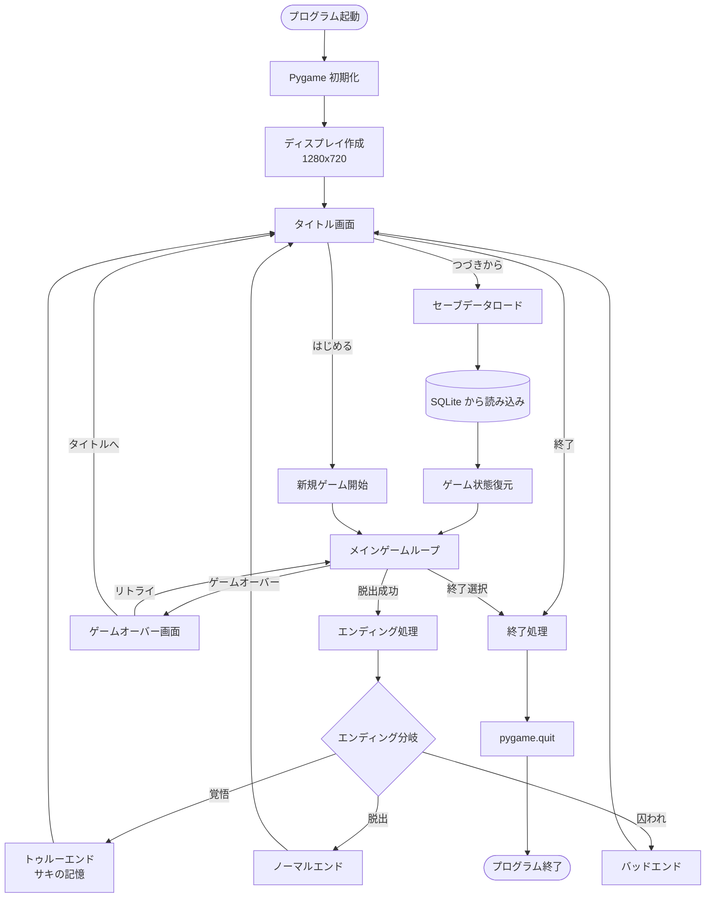
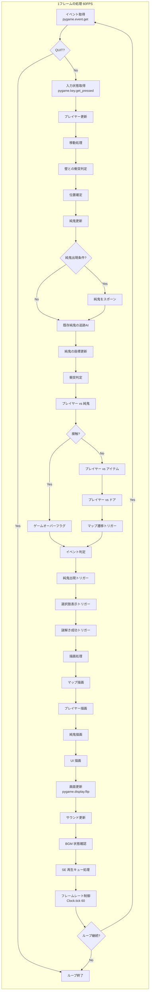
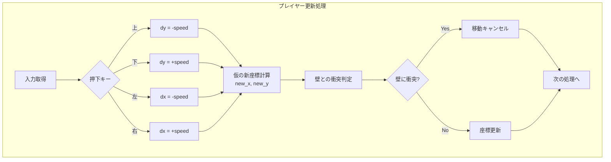
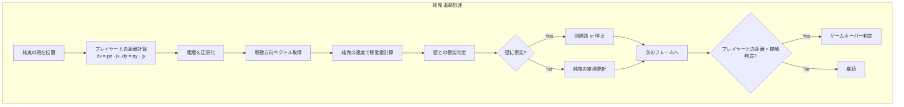
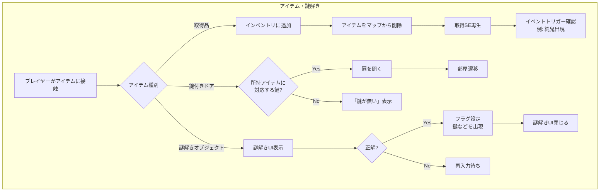
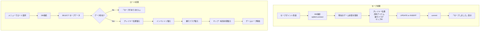
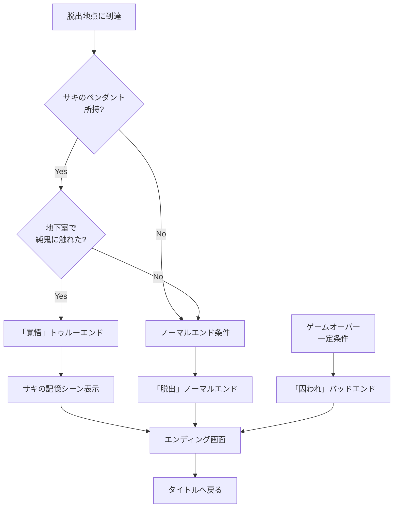
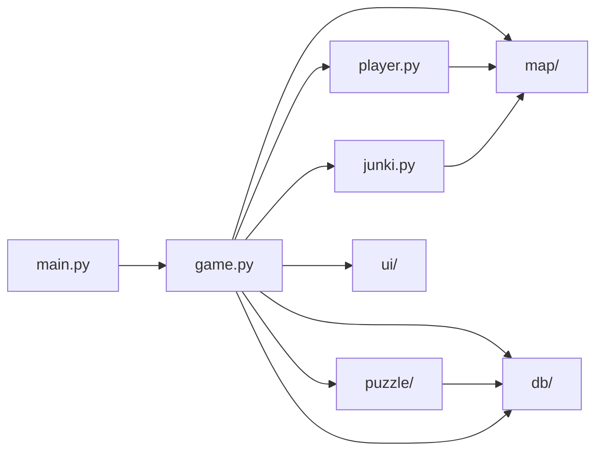

# 純鬼 処理フロー図

> ソースコードの処理の流れをフロー図で表現。

## draw.io（diagrams.net）用ファイル

以下の `.drawio` ファイルを [diagrams.net](https://app.diagrams.net/) で開いて編集・画像エクスポートができます。

| ファイル | 内容 |
|----------|------|
| [diagrams/01_全体フロー.drawio](diagrams/01_全体フロー.drawio) | アプリケーション起動～終了の全体フロー |
| [diagrams/02_メインゲームループ.drawio](diagrams/02_メインゲームループ.drawio) | 1フレーム（60FPS）の処理の流れ |
| [diagrams/03_プレイヤー純鬼AI.drawio](diagrams/03_プレイヤー純鬼AI.drawio) | プレイヤー更新処理 / 純鬼追跡AI |
| [diagrams/04_セーブロード_エンディング.drawio](diagrams/04_セーブロード_エンディング.drawio) | セーブ・ロード処理 / エンディング分岐 |
| [diagrams/05_モジュール依存関係.drawio](diagrams/05_モジュール依存関係.drawio) | モジュール間の呼び出し関係 |

**使い方**: [https://app.diagrams.net/](https://app.diagrams.net/) にアクセス → 「Open Existing Diagram」で上記ファイルを開く

---

## 1. 全体フロー（アプリケーション起動～終了）

---

## 2. メインゲームループ 詳細フロー

---

## 3. プレイヤー処理フロー

---

## 4. 純鬼（敵）追跡 AI フロー

---

## 5. アイテム取得・謎解きフロー

---

## 6. セーブ/ロード フロー

---

## 7. エンディング分岐フロー

---

## 8. モジュール依存関係（呼び出し関係）

---

## 補足

- **Mermaid**（以下）: Markdown 内でフロー図を記述。GitHub、Cursor 等でプレビュー可能
- **draw.io**: `diagrams/` フォルダの `.drawio` ファイルを diagrams.net で開いて編集可能。PNG/SVG 等でエクスポート可能
- オンラインビューワ: [Mermaid Live Editor](https://mermaid.live/)

---

*純鬼 処理フロー図 v1.0*
